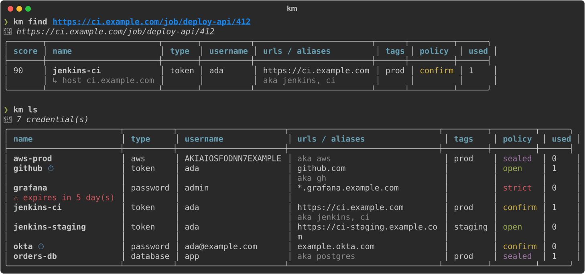
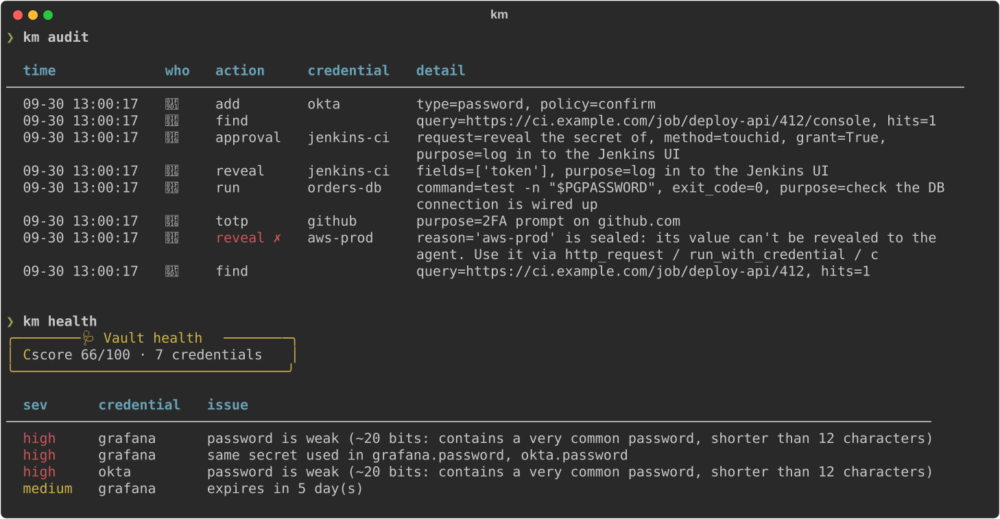

<h1 align="center">🔑 keymaster</h1>

<p align="center">
  <em>Your AI agent logs in by itself. Your passwords never touch the chat.</em>
</p>

<p align="center">
  <a href="https://github.com/kiraa06/keymaster/actions/workflows/ci.yml"></a>
  <a href="https://github.com/kiraa06/keymaster/releases/latest"></a>
  <a href="LICENSE"></a>
  
  
</p>

<p align="center">
  
</p>

Keymaster is a local, encrypted credential vault with an [MCP](https://modelcontextprotocol.io)
server built in. Tell your agent *"check the last build on ci.example.com"* and it finds the
right login from the URL, a name or an alias, then uses it. You don't paste passwords, you don't
say where they're kept, and in most cases the secret never enters the conversation.

```
you    ─► "why did the deploy-api job fail on https://ci.example.com/job/deploy-api/412?"
agent  ─► find_credentials("https://ci.example.com/job/deploy-api/412")  → jenkins-ci  (host match)
agent  ─► http_request(ref="jenkins-ci", url=".../412/consoleText")      → auth injected, output scrubbed
```

## Install

**Script**: macOS and Linux, one line, nothing else needed:

```sh
curl -fsSL https://raw.githubusercontent.com/kiraa06/keymaster/main/install.sh | sh
```

It installs [uv](https://docs.astral.sh/uv) if you don't have it and installs `km` and
`keymaster-mcp` from the latest release, checksum-verified and with their own Python (your
system Python is left alone). It registers the MCP server with Claude Code and offers to create
your vault. Re-run it any time to upgrade.

**uv**:

```sh
uv tool install git+https://github.com/kiraa06/keymaster
km init && km install-mcp
```

**pipx**:

```sh
pipx install git+https://github.com/kiraa06/keymaster
```

**From source**:

```sh
git clone https://github.com/kiraa06/keymaster && cd keymaster
uv tool install --editable .
```

### Requirements

- macOS 12+, or Linux with a Secret Service keyring (GNOME Keyring / KWallet)
- Any MCP client: [Claude Code](https://claude.com/claude-code), Claude Desktop, Cursor, …
- Optional: Touch ID (macOS), `zenity` for approval dialogs on Linux, `xclip` / `wl-clipboard`

## Use it

```sh
km init                                   # master passphrase + one-time recovery code
km add jenkins-ci -t token -u ada --url https://ci.example.com -a jenkins -a ci
km add aws-prod  -t aws -u AKIA… -f region=eu-central-1 -p sealed
km add orders-db -t database -u app -f host=db1.internal -f port=5432
km add github    -t ssh_key --from-file ~/.ssh/id_ed25519 --url github.com
km add okta      -u ada --url '*.okta.com' --totp       # with its 2FA seed
km touchid setup                          # approve with your fingerprint 👆
```

Then ask your agent to do things. It calls `find_credentials` whenever a task needs a login,
because the server tells it to.

| Command | |
|---|---|
| `km ls` · `km find <url\|name\|phrase>` · `km show <ref> [--reveal]` | look things up |
| `km add` · `km edit` · `km rm` · `km restore` · `km trash` · `km purge` | manage |
| `km copy <ref>` · `km totp <ref> --watch` · `km run <ref> -- <cmd>` | use |
| `km history <ref>` · `km rollback <ref> <version>` | undo a change |
| `km health [--pwned]` · `km audit [--verify]` · `km doctor` | check |
| `km lock` · `km unlock` · `km panic` | lock up |
| `km passwd` · `km recovery` · `km rotate-key` | keys |
| `km export` · `km import` · `km backups ls\|restore\|prune` | move / restore |
| `km gen [-w 5]` · `km strength` · `km config list\|set` · `km types` | misc |

## What it does

### Finds the right login from whatever the agent has

A credential can be looked up by its **name**, **aliases**, **URLs** (full URLs with path
prefixes, bare hosts, `*.wildcards`), a `host` field, **tags** or username, and typos are
tolerated. `https://ci.example.com/job/deploy-api/412` finds `jenkins-ci`, and so do `jenkins`,
`ci`, and `jenkns`. When two credentials fit equally well, the agent is told to ask you instead
of guessing.

### Uses secrets without showing them

| Tool | What the agent gets |
|---|---|
| `http_request` | the response. Auth is injected (basic for `user:token` like Jenkins, bearer, a custom header or a query param) and **only sent to hosts registered on that credential** |
| `run_with_credential` | command output with the secret scrubbed, including its base64, URL, hex and `user:pass` forms. The env gets `$KM_USERNAME` `$KM_PASSWORD` `$KM_TOKEN`…, plus `AWS_*` for AWS, `PG*`/`MYSQL_PWD` for databases, and a temp `0600` key file for SSH keys |
| `get_totp` | the current 2FA code |
| `copy_to_clipboard` | nothing. You paste it yourself, and the clipboard clears after 30s |
| `get_credential(reveal=true)` | the raw value, only when it must type it into a browser, and only if the policy allows |

### Asks you first

Every credential has a policy:

| policy | agent can **use** it | agent can **reveal** it |
|---|---|---|
| `open` | ✅ | ✅ |
| `confirm` *(default)* | ✅ | after you approve; "Allow for 8h" remembers the approval |
| `sealed` | ✅ | ❌ never |
| `strict` | each time you approve | each time you approve |

Approval is a native dialog or Touch ID, shown to you and not the agent. The agent can't loosen a
policy or purge a credential without your approval. Running `km` through the agent's shell
doesn't get around this, because without a real terminal `km` treats the caller as the agent.

### You type secrets, not the agent

`add_credential` defaults to `secret_source="prompt"`: a secure dialog pops up, you type, and the
agent only hears "stored". It can also read the secret from the clipboard (then wipe it), from a
file (SSH keys, service-account JSON), or generate one it never sees.
`generate_secret(store_in=…)` rotates a password the same way.

### Keeps receipts

<p align="center">
  
</p>

Every find, reveal, use, approval and change goes into an **HMAC hash-chained audit log**.
`km audit --verify` pinpoints any edited or deleted line. `km health` grades the vault A–F: weak,
reused, expired, stale and unused secrets, plus breached passwords via HaveIBeenPwned (with
k-anonymity, so only 5 hash characters leave your machine).

### Is hard to lose

It keeps version history per credential with rollback, a trash can, 20 rolling encrypted
snapshots, a recovery code, and a separately-encrypted `km export`. It can import from Chrome,
Bitwarden and 1Password CSVs or `.env` files, and it works as a git credential helper:
`git config --global credential.helper '!km git-credential'`.

## Security

- **Encryption**: AES-256-GCM under a random data key, wrapped by **Argon2id** (64 MiB) from your
  passphrase, with a second key slot for a 150-bit recovery code.
- **Integrity**: tampering with the file, splicing an old copy under a new header, or rolling
  back to an older copy are all detected.
- **While unlocked**: the key lives in the **macOS Keychain** / Secret Service, never in a file
  or on a command line. `km lock` / `km panic` drops it, and you can set `auto_lock_hours`.
- **Brute force**: wrong passphrases trigger a backoff. Everything is written atomically and
  file-locked, with `0600` permissions.

**Threat model:** Keymaster protects secrets at rest and keeps them out of AI transcripts by
default. It does not stop malware already running as you while the vault is unlocked, and the
agent isn't sandboxed. A determined prompt injection could get `run_with_credential` to print a
secret in a form the scrubber misses. Use `sealed` / `strict` for crown jewels.
Details: [`docs/DESIGN.md`](docs/DESIGN.md). To report a vulnerability, see
[SECURITY.md](SECURITY.md).

## Other MCP clients

`km install-mcp` does it for Claude Code. For anything else (Claude Desktop, Cursor, Windsurf, …):

```json
{ "mcpServers": { "keymaster": { "command": "~/.local/bin/keymaster-mcp" } } }
```

Use the absolute path that `which keymaster-mcp` prints.

## Troubleshooting

**The agent says the vault is locked.** Run `km unlock`, or let it call `unlock_vault`, which
asks you for the passphrase in a dialog. If you set `auto_lock_hours`, this is expected.

**No approval dialog appears.** On macOS, check that the dialog isn't hiding behind other windows.
Approvals time out after 90s and count as denied. On Linux, install `zenity`. On a headless
box, run `km config set approval deny` and use `open` / `sealed` policies.

**`Keychain unavailable` on Linux.** Keymaster needs a Secret Service provider. Install and
start GNOME Keyring (`gnome-keyring-daemon`) or KWallet in your session.

**`command not found: km`.** `~/.local/bin` isn't on your `PATH`:

```sh
echo 'export PATH="$HOME/.local/bin:$PATH"' >> ~/.zshrc && exec zsh
```

**I forgot my passphrase.** Run `km unlock` and paste the recovery code. Then `km passwd` sets a
new passphrase and `km recovery` mints a fresh code.

**Everything else.** Run `km doctor`.

## Uninstall

```sh
claude mcp remove keymaster -s user
uv tool uninstall keymaster
rm -rf ~/.keymaster            # ⚠ deletes your vault — `km export` first if you want it
```

## Contributing

Issues and pull requests are welcome; see [CONTRIBUTING.md](CONTRIBUTING.md).

## License

[MIT](LICENSE)
